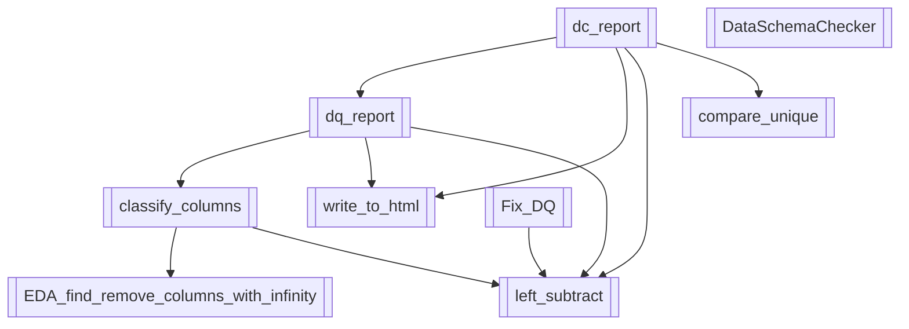

ver. 1.02 (beta) - <u>Documentation</u> **(WIP)**: **[🇺🇸 EN]()** | **[🇷🇺 RU]()**

> This library is planned to be merged with [Gnomych](https://github.com/avrtt/gnomych), my other data analytics toolkit. Gnomych classes will become a part of the main branch since 1.2 version.

<br/>

**Paysage** is a minimalistic toolkit of useful Pandas extras for ensuring data quality in your DataFrames. It simplifies cleaning, profiling and improving your datasets so that you can focus on delivering more reliable data insights. 

- [Introduction](#introduction)
- [Key components](#key-components)
- [Use cases](#use-cases)
  - [1. Data quality report](#1-🔎-data-quality-report-dq_report)
  - [2. Data comparison report](#2-⚖️-data-comparison-report-dc_report)
  - [3. Data cleaning](#3-🔧-data-cleaning-with-fix_dq)
  - [4. Schema validation](#4-📋-schema-validation-with-dataschemachecker)
- [Installation](#installation)
- [Usage](#usage)
- [API](#api-overview)
- [To do](#to-do)
- [Contributing](#contributing)
- [License](#license)

## Introduction
**Paysage** is a Python library that helps with data quality analysis and enhancement. Designed for speed and scalability, it integrates with `pandas` and `scikit-learn` to:
- quickly clean and enhance your DFs
- provide data quality reports
- assist in data preprocessing before modeling
- integrate with existing `sklearn` pipelines

With paysage, you can easily assess issues such as missing values, outliers and data inconsistencies while also benefiting from data profiling and transformation tools.

## Key components


`paysage` is organized into several core modules:

- 🔎 **dq_report**  
  Generates a detailed data quality report (inline or HTML) that inspects your dataset for issues such as missing values, outliers, duplicates, correlation anomalies and potential data leakage.
- ⚖️ **dc_report**  
  Compares two DataFrames (commonly train vs. test) and highlights their differences. It includes statistical tests like the KS Test to compare distributions and examines discrepancies in missing/unique values.
- 🔧 **Fix_DQ**  
  A `scikit-learn` compatible transformer that automatically detects and corrects data quality issues. It handles a variety of problems — from ID columns and zero-variance features to outliers and imbalanced classes — in just one line of code.
- 📋 **DataSchemaChecker**  
  Validates whether your DataFrame adheres to a specified schema. It checks data types, reports mismatches and attempts to coerce columns to the desired types.

## Use cases

### 1. 🔎 Data quality report (`dq_report`)

The `dq_report` function generates a comprehensive report (either inline or as an HTML file) by scanning your dataset for:
- ID columns, zero-variance features and rare categories (less than 5% representation)
- Infinite values and mixed data types
- Outliers (using the Inter Quartile Range)
- High cardinality and highly correlated features (correlation > 0.8)
- Duplicate rows/columns and skewed distributions (skew > 1.0)
- Imbalanced classes and potential feature leakage

For very large datasets, a sample of 100K rows is used by default. If you prefer full-data analysis, load your data into a DataFrame before passing it to the function.

### 2. ⚖️ Data comparison report (`dc_report`)

The `dc_report` tool accepts two DataFrames (e.g., train and test) and generates a comparison report by:
- Running `dq_report` on each DataFrame to compare their data quality metrics
- Calculating the Kolmogorov-Smirnov test statistic for numeric features
- Comparing missing and unique value percentages, with special notes when discrepancies arise
- Allowing target columns to be excluded from the comparison

> Tip: for large datasets, consider sampling your data before using this report tool.

### 3. 🔧 Data cleaning with `Fix_DQ`

The `Fix_DQ` class is a one-stop solution to clean your data before modeling. It's implemented as a `scikit-learn` transformer and can be integrated into your ML pipelines. During the `fit` process, it:
- Removes ID and zero-variance columns
- Groups rare categories into a "Rare" label
- Handles infinite values, mixed data types and outliers
- Identifies high cardinality and highly correlated features (dropping one of each pair)
- Removes duplicate rows/columns and applies transformations to skewed distributions

> **Integrate with GridSearchCV:** Use `Fix_DQ` in your hyperparameter tuning pipelines (e.g., with GridSearchCV) to select the best data cleaning strategy alongside your model.

### 4. 📋 Schema validation with `DataSchemaChecker`

The `DataSchemaChecker` transformer ensures that your data conforms to a predefined schema. You simply:
1. Define a schema (a dictionary mapping column names to expected data types)
2. Use the `fit` method to identify discrepancies between your data and the schema
3. Call `transform` to automatically adjust column data types, skipping those that cannot be coerced and reporting errors

Example schema:

```python
schema = {
    'name': 'string',
    'age': 'float32',
    'gender': 'object',
    'income': 'float64',
    'date': 'date',
    'target': 'integer'
}
```

## Installation
 
`paysage` requires only `pandas`, `numpy` and `scikit-learn` — all of which are commonly included in Python3 Anaconda distributions.

Clone and navigate:
```
git clone git@github.com:avrtt/paysage.git && cd paysage
```

Create and activate a virtual environment (**recommended**):
```
python -m venv venv
source venv/bin/activate
```

If you're using newer Python versions (3.12+), install `setuptools` ([here's why](https://docs.python.org/3.12/whatsnew/3.12.html)):
```
pip install setuptools
```

Finally, install the library:
```
pip install -r requirements.txt
```

## Usage

### Quick data profiling

To generate a data quality report:

```python
from paysage import dq_report

dqr = dq_report(data, target='your_target_column', html=False, csv_engine="pandas", verbose=1)
```

This will display the report inline (or generate an HTML file, if configured).

### Comparing two datasets

To compare train and test DataFrames:

```python
from paysage import dc_report

dc_report(train, test, exclude=[], html=True, verbose=1)
```

The function returns a DataFrame outlining differences between your datasets.

### Data cleaning with `Fix_DQ`

Clean your training and test datasets with a single transformer:

```python
from paysage import Fix_DQ

# initialize transformer with default parameters
fdq = Fix_DQ()

# clean the training data
X_train_transformed = fdq.fit_transform(X_train)

# apply the same transformation to test data
X_test_transformed = fdq.transform(X_test)
```

### Schema validation

Validate and adjust your DataFrame to match a specific schema:

```python
from paysage import DataSchemaChecker

# define your schema
schema = {
    'name': 'string',
    'age': 'float32',
    'gender': 'object',
    'income': 'float64',
    'date': 'date',
    'target': 'integer'
}

# validate training data and then transform test data
ds = DataSchemaChecker(schema=schema)
ds.fit_transform(X_train)
X_test_transformed = ds.transform(X_test)
```

## API overview

`paysage` is built with a simple API designed to uncover and fix data quality issues quickly.

### 🔎 dq_report

**Inputs:**
- `data`: File path (string) or a pandas DataFrame.
- `target`: (Optional) Column name as a string to focus on target-related issues.
- `html`: (Boolean) Set to `True` for HTML output.
- `csv_engine`: (String) Choose between `pandas`, `arrow`, or `parquet` for CSV reading.
- `verbose`: (Integer) Use `0` for a summary report and `1` for a detailed report.

**Output:**  
A DataFrame highlighting data quality issues.

### ⚖️ dc_report

**Inputs:**
- `train`: Training DataFrame.
- `test`: Test DataFrame.
- `exclude`: List of columns to exclude from the comparison.
- `html`: (Boolean) Toggle HTML output.
- `verbose`: (Integer) Toggle between summary and detailed reports.

**Output:**  
A DataFrame that outlines the differences between the two datasets.

### 🔧 Fix_DQ

A `scikit-learn` transformer that cleans your data by addressing issues such as:
- ID and zero-variance columns removal.
- Rare category grouping.
- Infinite value replacement.
- Mixed data type handling.
- Outlier detection.
- Duplicate row/column removal.
- Skewed distribution transformations.

**Additional Parameters:**
- `quantile`: Threshold for IQR-based outlier detection.
- `cat_fill_value`: Default fill value (or a dictionary) for missing categorical data.
- `num_fill_value`: Default fill value (or a dictionary) for missing numerical data.
- `rare_threshold`: Threshold to identify rare categories.
- `correlation_threshold`: Correlation limit (default is 0.8) for dropping one of two highly correlated features.

### 📋 DataSchemaChecker

**Inputs:**
- `schema`: A dictionary mapping column names to expected data types.

**Methods:**
- `fit`: Checks and reports discrepancies between the DataFrame and the schema.
- `transform`: Attempts to coerce columns to match the schema, reporting any conversion errors.

## To do
- (!) Documentation
- Split code by modules, create utils.py for helper functions
- Implement more classes for better logic
- Implement more advanced methods

## Contributing
Contributions are welcome. Feel free to open PRs and issues.

## License
MIT